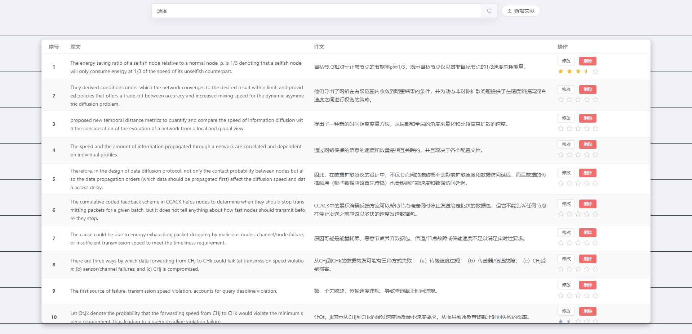

<div align="center">
  
  <h1>WebDict</h1>
</div>

  


This project is used to look up example sentences as you write your thesis. It's developing with Vue 3 in Vite.

Please check the `github/webdict-server` for the server of this project.

## Features

- Retrieve example sentence
- Rate for sentence
- Modify and Delete some bad sentence

## Preview



## Recommended IDE Setup

[VSCode](https://code.visualstudio.com/) + [Volar](https://marketplace.visualstudio.com/items?itemName=Vue.volar) (and disable Vetur) + [TypeScript Vue Plugin (Volar)](https://marketplace.visualstudio.com/items?itemName=Vue.vscode-typescript-vue-plugin).

## Quick Start

- Project Setup

```sh
npm install
```

- Compile and Hot-Reload for Development

```sh
npm run dev
```

- Compile and Minify for Production(Developemnt)

```sh
npm run build[_dev]
```

- Lint with [ESLint](https://eslint.org/)

```sh
npm run lint
```

## CI/CD
supproted by `GitHub Actions`

When you push code to the branch "main", it will trigger the Action "Build & Deploy", which will build the project and deploy it to the remote server(you need to config your own secrets).

Please check the file `.github\workflows` for more details.

